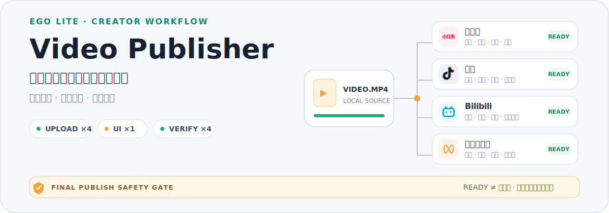

<p align="center">
  
</p>

<p align="center">
  小红书 · 抖音 · Bilibili · 微信视频号<br>
  <strong>并行上传，逐项验收，默认不发布</strong>
</p>

Video Publisher 是一个面向 Codex / Claude Code 的视频发布 Skill。给它一个本地视频，它会通过 Ego Lite 操作真实创作者页面，为你配置的平台完成上传、标题与标签、原创声明、可选封面和发布前检查，最后把每个平台留在可人工复核的状态。

> [!IMPORTANT]
> 默认流程不会点击最终发布按钮。只有用户在当前任务中明确授权，才允许真正发布；这项权限不会写进配置，也不会被下次任务继承。

## 已经验证到什么程度

截至 2026-07-15，项目已完成：

| 真实创作者页面 | 韧性回归 | 自动化测试 | 最终发布误触 |
| ---: | ---: | ---: | ---: |
| 4 个平台 | 19 轮 | 48 / 48 | 0 次 |

真实回归覆盖了四平台冷启动、连续无操作重跑、旧草稿隔离、上传中断、填写中断、Ego Lite 崩溃、任务空间删除与 ID 复用、状态文件损坏、重复任务竞争、超大视频和抖音 15 分钟边界等场景。

这些数字代表当前版本经过的真实测试，不是对平台永不改版的承诺。页面发生变化时，Skill 会返回可诊断的阻塞状态，不会把“点过了”误报成 `READY`。

## 它会完成什么

| 平台 | 发布前准备 |
| --- | --- |
| 小红书 | 标题、真实话题实体、原创声明、可选 3:4 封面 |
| 抖音 | 标题与正文、真实话题实体、原创声明、可选 3:4 / 4:3 封面 |
| Bilibili | 标题、简介、标签、自制声明、可选 4:3 封面、旧草稿隔离 |
| 微信视频号 | 描述与话题、原创声明、可选 3:4 / 4:3 封面 |

它不会制作或编辑封面；如果你已经有封面文件，可以选择让 Skill 上传。

## 为什么它更稳定

Video Publisher 不是让四个 Agent 同时在页面上盲点。它使用一个状态化调度器，根据资源类型安排工作：

1. **并行检查**：确认登录状态、页面状态和草稿身份。
2. **并行上传**：所选平台同时上传，并等待平台真正处理完成。
3. **串行填写**：标题、标签、声明和封面一次只操作一个页面，避免 Ego Lite 的输入通道互相干扰。
4. **并行验收**：重新读取页面，只有所有必需状态都有新证据时才返回 `READY`。

任务空间、草稿身份、状态备份和封面回执都会持久化。流程中断后再次运行同一个任务，会先检查真实页面，再决定复用、修复或重新上传，而不是从头猜测。

## 快速开始

### 1. 准备环境

- [Ego Lite](https://lite.ego.app/) 与可用的 `ego-browser` 命令
- Node.js 18 或更高版本
- 已在 Ego Lite 中登录需要使用的创作者平台

### 2. 安装 Skill

Codex：

```bash
git clone https://github.com/oil-oil/video-publisher-skill.git
mkdir -p ~/.codex/skills/video-publisher
cp -R video-publisher-skill/video-publisher/. ~/.codex/skills/video-publisher/
```

Claude Code：

```bash
mkdir -p ~/.claude/skills/video-publisher
cp -R video-publisher-skill/video-publisher/. ~/.claude/skills/video-publisher/
```

### 3. 在对话中使用

```text
使用 $video-publisher，把 /path/to/video.mp4 准备到小红书、抖音、Bilibili 和微信视频号，全部停在发布前。
```

第一次使用会自动进入 onboarding。它会先问你实际拥有哪些创作者平台账号，再从这些可用平台中选择默认发布平台；如果你只有小红书和抖音，后续就不会打开 Bilibili 或微信视频号。平台专属问题也会按选择出现，例如没有抖音时不会询问抖音默认话题。

之后才会配置素材目录、文案与标签偏好，以及原创声明策略。个人配置保存在 `~/.config/video-publisher/config.json`，不会写入 Skill 目录。

之后只需要给出视频路径；当前任务中的明确要求会覆盖个人默认配置。

## 安全边界

- 页面会挂载最终发布按钮硬保护；保护未成功启用时不能返回 `READY`。
- 原创 / 自制声明只会在用户已保存真实的长期原创策略，或本次明确确认权利时启用。
- 每次运行都会核对本地视频和封面的精确路径，避免把相似文件传错。
- Ego Lite 输入通道中断后，调度器会停止后续页面修改，只保留只读检查和可恢复状态。
- 检测到用户接管浏览器时，所有自动化操作会立即停止。

## 已知边界

- 这是基于真实网页的浏览器自动化，依赖平台登录状态，也可能受到平台改版、风控或服务波动影响。
- Skill 当前只负责准备和验证视频草稿，不负责剪辑、转码或制作封面。
- 抖音视频超过实测 15:00 边界时会在打开浏览器前拦截；其他平台仍可继续准备。
- `READY` 表示当前页面证据完整且可以人工复核，不等于内容已经发布。

## 自定义自己的发布流程

如果你希望增加自己的步骤，例如“抖音填写标签后点击某个设置按钮”，直接把平台、触发时机、按钮文字或附近区域，以及成功后的页面状态告诉 Agent。

项目内的[自定义发布流程扩展规范](video-publisher/references/customizing-workflows.md)会指导 Agent 将这一步实现成可重复运行的 `inspect → action → verify` 流程，并通过真实页面测试，而不是把一次性的坐标点击写死。

## 开发与验证

运行全部自动化测试：

```bash
node --test video-publisher/scripts/tests/*.test.mjs video-publisher/scripts/v2/tests/*.test.mjs
```

进一步了解实现与真实测试边界：

- [Skill 主流程](video-publisher/SKILL.md)
- [配置与 onboarding](video-publisher/references/configuration.md)
- [Ego Lite 工作流](video-publisher/references/ego-browser-workflow.md)
- [调度器与诊断命令](video-publisher/references/scripts.md)

## License

[MIT](LICENSE)
